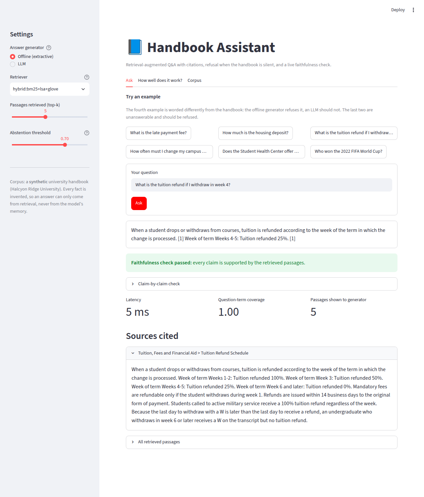
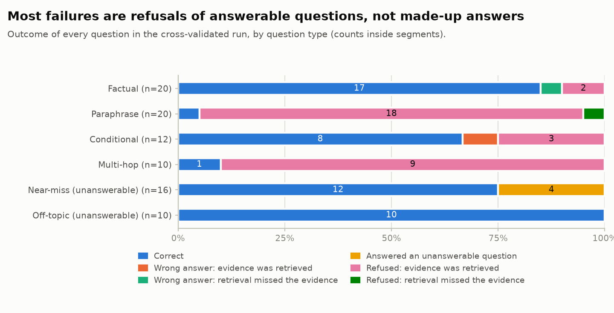
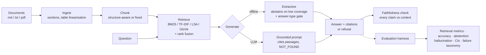

# RAG Assistant with an Evaluation Harness

> Most people build a chatbot. Few measure one.

A retrieval-augmented question-answering system over a university handbook, built around a single question:
**how would you know if it were wrong?** It answers with citations, refuses when the handbook is silent, checks its
own answers for unsupported claims, and ships with the harness that measures all of it - retrieval accuracy,
faithfulness, hallucination, abstention - with confidence intervals, ablations and a failure taxonomy.

It runs **fully offline** (no API key, no model download) and plugs into **Anthropic**, **ModelScope** or any
**OpenAI-compatible** LLM with environment variables.



*The web app: an answer, a claim-by-claim faithfulness check, and the cited source. Unanswerable questions are refused (`docs/app_refusal.png`); the second tab shows the evaluation (`docs/app_evaluation.png`).*

## Results at a glance

Offline extractive generator (no LLM), **nested 5-fold cross-validation over 88 questions**, 95% bootstrap CIs. Every question is scored by a configuration that never saw it.

| | Value | |
|---|---|---|
| Gold evidence in the top 5 (Hit@5) | **0.98** (0.95-1.00) | retrieval is not the bottleneck |
| Mean reciprocal rank | 0.92 (0.85-0.97) | |
| Answer accuracy (answerable questions) | **0.44** (0.31-0.56) | the generator is |
| Refuses correctly (unanswerable questions) | **0.85** (0.69-0.96) | |
| Hallucination rate (all questions) | **0.05** (0.01-0.09) | vs **0.23** for a naive RAG that always answers |
| Unfaithful answers | 0.00 | by construction: the offline generator can only quote |

**What the evaluation found** (details, tables and figures in the report):

1. **Retrieval is fine; the generator is the bottleneck.** The evidence is retrieved for 98% of answerable questions, but the offline generator answers
   only 44%: it refuses 18 of 20 paraphrased and 9 of 10 multi-hop questions even though it holds the evidence. That is the gap an LLM generator exists to close.
2. **Abstention is the one design decision with a measurable effect.** Adding it cuts the hallucination rate by 0.18 (paired 95% CI -0.26 to -0.10) and
   costs 0.15 of answer accuracy (-0.26 to -0.03). Chunking, retriever and top-k choices make no statistically detectable difference at this sample size. There is no free lunch: the report plots the whole trade-off curve.
3. **Embeddings trade off, they do not simply win.** A GloVe hybrid lifts MRR on paraphrased questions (0.62 to 0.73) and lowers it slightly on the rest (0.98 to 0.92).
4. **Honest evaluation changed the answer.** In an earlier iteration, thresholds tuned on a fixed dev split scored 0.75 balanced on dev and 0.50 on test.
   That is why the headline is cross-validated.
5. **The evaluator was checked, too.** The faithfulness scorer is 80% accurate on 30 hand-labelled answers (its known blind spots are listed), and it caught
   23 of 25 deliberately injected faults with 0 false alarms on untouched answers. Writing the tests exposed two real bugs in the scorer itself
   (a determiner "No..." treated as a negation, and truncated quotes flagged as unfaithful); both are fixed and covered by tests.




Full write-up with every table and figure: [`reports/latest/report.md`](reports/latest/report.md).

## Why the corpus is synthetic

The handbook is for a fictional "Halcyon Ridge University". That is deliberate. If a question about a real university,
a real law or a real drug goes to an LLM, the model may answer from memory and you cannot tell whether retrieval helped.
Here every fact is invented, so **a correct answer can only have come from retrieval**, and any fact the model states
that is not in the retrieved text is, by construction, a hallucination. The corpus also contains traps:
near-duplicate facts (undergraduate vs graduate deadlines, two different deposits, three different "3.x" GPA thresholds)
and questions that sit right next to the corpus but are not answered by it.

Swap in your own documents (`--corpus path/to/folder`, `.md`, `.txt` or `.pdf`) and write a golden set in the same format.

## Architecture



## Quickstart

```bash
cd RAG_Assistant
pip install -r requirements-dev.txt

streamlit run app.py                                   # the web app
python -m rag_assistant ask "What is the late payment fee?"
python -m rag_assistant chat                           # interactive
python -m rag_assistant eval                           # score the tuned pipeline on the golden set
python -m rag_assistant study                          # nested CV + ablations + full report (about 10 minutes)
python -m rag_assistant report                         # re-render the report and figures from the last study, in seconds
python -m pytest -q                                    # tests
python -m rag_assistant check-data                     # golden set vs corpus integrity
```

Optional: `python -m rag_assistant fetch-embeddings` downloads 134 MB of GloVe vectors (from a GitHub release, cached in
`~/.cache/rag_assistant`, never in the repo) and enables the semantic retrievers. Docker: `docker build -t rag . && docker run -p 8501:8501 rag`.

## Use a real LLM

Copy `.env.example` to `.env` (git-ignored) and fill in one provider. Real environment variables always win.

| Provider | Variables | Notes |
|---|---|---|
| **ModelScope** | `MODELSCOPE_API_KEY`, optional `RAG_LLM_MODEL` | OpenAI-compatible endpoint `https://api-inference.modelscope.cn/v1`. List what your key can use with `python -m rag_assistant llm-models`. Hybrid-reasoning models may need `RAG_LLM_EXTRA_JSON={"enable_thinking": false}`. |
| **Anthropic** | `ANTHROPIC_API_KEY`, optional `RAG_LLM_MODEL` (default `claude-opus-5-5`) | Uses the official SDK (`pip install anthropic`). No sampling parameters are sent - current Claude models reject them. Refusals fail closed. |
| **OpenAI-compatible** | `OPENAI_API_KEY`, optional `OPENAI_BASE_URL`, `RAG_LLM_MODEL` | OpenAI, vLLM, Ollama, ... |

```bash
python -m rag_assistant ask --generator llm "How do I get a refund if I drop a class in week 4?"
python -m rag_assistant eval --generator llm            # same 88 questions, same metrics
python -m rag_assistant eval --generator llm --judge    # plus an LLM judge for semantic errors
```

The generator is instructed to answer only from numbered passages, cite them, and reply `NOT_FOUND` otherwise. If the
provider errors out or refuses, the assistant **fails closed** (it declines to answer) instead of guessing.
Keys are read from the environment only, sent only to the provider's own endpoint, and never appear in error messages
(this is tested).

## How it is evaluated

**Golden set** (`data/eval/golden_set.yaml`): 88 hand-written questions in six types - factual, paraphrase (little word overlap
with the source), conditional (undergraduate vs graduate), multi-hop (two passages), and two kinds of unanswerable
(*near-miss*: same topic, fact absent; *off-topic*). Each answerable question has a reference answer, required facts, and
**verbatim evidence phrases**. Evidence is matched as text, not by chunk id, so different chunking strategies are compared fairly.

| Metric | Definition |
|---|---|
| Hit@k / Recall@k | Gold evidence appears in the top-k chunks (any / fraction of required phrases) |
| MRR, nDCG@5 | Rank quality of the first / all relevant chunks |
| Answer accuracy | Answerable question answered with **every** required fact |
| False-refusal rate | Answerable question the system refused |
| Abstention accuracy | Unanswerable question correctly refused |
| Unfaithful rate | Answers containing a claim not supported by the retrieved text (numbers, negation and wording are checked per claim) |
| Hallucination rate | Over **all** questions: answered AND (unanswerable OR unfaithful) |
| Balanced score | Mean of answer accuracy and abstention accuracy - so "refuse everything" cannot look good |

**Failure taxonomy.** Every question lands in one bucket, so you can tell *why* it failed: correct; wrong answer
(retrieval missed the evidence / evidence was retrieved but the generator got it wrong); refused (retrieval missed / evidence
was retrieved but the generator was over-cautious); answered an unanswerable question.

**Protocol.** With ~90 questions a fixed dev/test split is too noisy - thresholds tuned on 13 unanswerable dev questions looked
excellent on dev and poor on test. Headline numbers therefore come from **nested 5-fold cross-validation**: in each fold every
selection (chunking, retriever, top-k, abstention thresholds) is made on the training folds only, and the held-out fold is scored.
Intervals are 95% bootstrap CIs over questions; ablation deltas use paired bootstrap.

**Evaluating the evaluator.** A hallucination metric you have not validated is a guess.
- `data/eval/support_calibration.yaml`: 30 hand-labelled (context, answer) pairs measure the faithfulness scorer's accuracy, and deliberately
  include cases it is *known to miss* (synonym paraphrases, swapped entities, changed units, flipped quantifiers) so the report states its blind spots.
- **Fault injection**: a known fraction of answers is corrupted (changed number, invented sentence, flipped negation) and the harness must find them.
- `tests/test_data_integrity.py`: every evidence phrase occurs exactly once in the corpus, every required fact is derivable from its evidence,
  and the checker itself is shown to fail on deliberately corrupted data.
- An optional **LLM judge** (`--judge`) covers semantic errors the lexical scorer cannot see; judge failures are excluded, not guessed.

**CI quality gate.** `python -m rag_assistant eval --gate` fails the build if retrieval or answer quality drops below
`reports/gates.json`, which `study` regenerates. See `.github/workflows/rag-assistant.yml`.

## Project layout

```
RAG_Assistant/
  app.py                     Streamlit app (ask · evaluation dashboard · corpus)
  rag_assistant/
    ingest.py                sections, table linearisation, chunking
    retrievers.py            BM25 · TF-IDF · LSA · dense hook · random floor · rank fusion
    embeddings.py            GloVe semantic retriever (downloaded on demand, cached outside the repo)
    generators.py            extractive generator (abstention + answer-type gate) · LLM generator
    llm.py                   Anthropic · ModelScope / OpenAI-compatible clients, retries, fail-closed
    pipeline.py              chunk -> index -> retrieve -> generate
    evaluation/              dataset + integrity · metrics · faithfulness scorer · harness ·
                             ablations + nested CV · calibration + fault injection · judge · report · gate
  data/corpus/               10 synthetic handbook documents
  data/eval/                 golden set · faithfulness calibration set
  reports/                   generated report, figures, per-question results, tuned config, gates
  tests/                     unit, integration, UI and CLI tests
```

## Limitations (read these)

- **The reported numbers are for the offline extractive generator.** It can only quote the handbook, so its faithfulness is high by
  construction and its answer accuracy is a floor, not what an LLM achieves. The LLM path is implemented and tested against a local mock
  server, but **has not been measured against a live model** in the environment that produced this report; run `eval --generator llm` to get
  those numbers on the same questions.
- **Small, single-author evaluation.** 88 questions and one annotator; intervals are wide and differences of a few points are not significant.
- **Synthetic wording.** Paraphrase difficulty reflects how one person paraphrases, not real users. Log real questions and label a sample.
- **Lexical faithfulness scoring** has known blind spots (see the calibration set and report section 6); use `--judge` for semantic checks.
- **LSA adds nothing on a corpus this small** (87 chunks); it is included because the ablation shows that, not because it helps.

## What I would do next

Real embedding models via `DenseRetriever` (sentence-transformers) and a cross-encoder reranker; a larger golden set built from
logged user questions; inter-annotator agreement; a stronger paraphrase test set; and latency/cost tracking per LLM provider.
