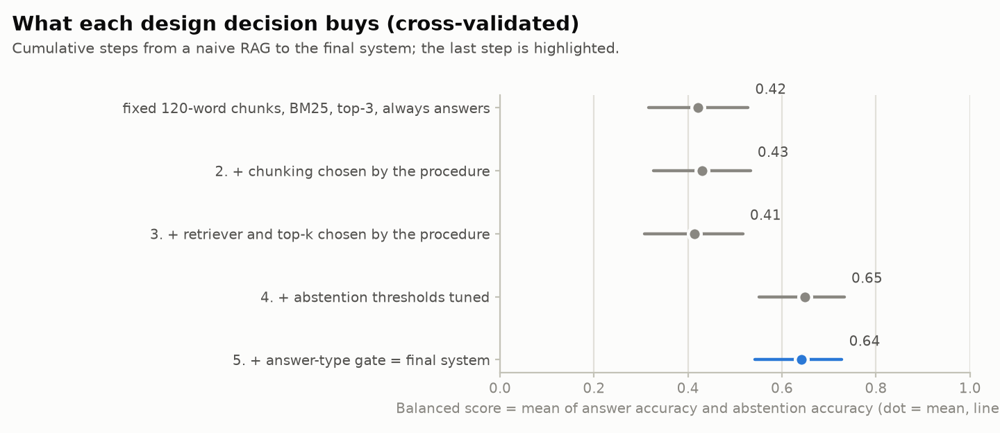
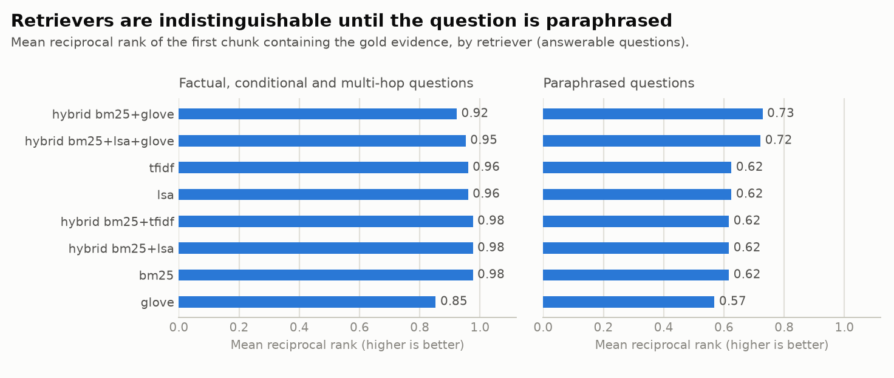
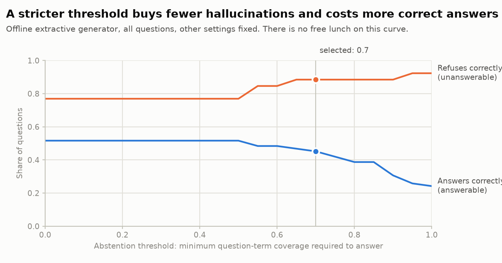

# RAG evaluation report

Halcyon Ridge University handbook (synthetic) - 2026-09-29 - generated by `python -m rag_assistant study`.

**Setup.** 68 sections in 10 documents, 70 chunks with the selected chunking. Golden set: **88 questions** (62 answerable, 26 unanswerable). Generator: offline extractive (no LLM). Every number below is either a cross-validated estimate or is labelled otherwise; intervals are 95% bootstrap CIs over questions.

## 1. Headline - cross-validated

Nested 5-fold cross-validation: in each fold the chunking, retriever, top-k and abstention thresholds are chosen on the training folds only, and the held-out fold is scored. Each question is answered by a configuration that never saw it.

| Metric | Value (95% CI) | Meaning |
|---|---|---|
| Retrieval: Hit@1 | 0.89 (0.81-0.95) | Correct evidence is the top-ranked chunk |
| Retrieval: Hit@5 | 0.98 (0.95-1.00) | Evidence appears somewhere in the top 5 |
| Retrieval: Recall@5 | 0.98 (0.95-1.00) | Share of required evidence phrases found in the top 5 (multi-hop needs several) |
| Retrieval: MRR | 0.92 (0.85-0.97) | 1 / rank of the first relevant chunk |
| Retrieval: nDCG@5 | 0.93 (0.87-0.97) | Ranking quality of the top 5 |
| Answer accuracy | 0.44 (0.31-0.56) | Answerable questions answered with every required fact |
| False-refusal rate | 0.53 (0.40-0.66) | Answerable questions the system refused (lower is better) |
| Abstention accuracy | 0.85 (0.69-0.96) | Unanswerable questions correctly refused |
| Unfaithful-answer rate | 0.00 (0.00-0.00) | Answers with a claim unsupported by the retrieved text (lower is better) |
| Hallucination rate | 0.05 (0.01-0.09) | All questions: answered AND (unanswerable OR unfaithful) (lower is better) |
| Balanced score | 0.64 (0.54-0.73) | Mean of answer accuracy and abstention accuracy |
| Citation precision | 0.90 (0.79-0.98) | Cited chunks that really contain the evidence |
| Token F1 vs reference | 0.59 (0.51-0.68) | Word overlap with the reference answer (answered questions only) |

Latency (median / p95): 2.7 ms / 6.6 ms per question, retrieval and generation included.

**How to read this.**
- Retrieval is strong: the gold evidence is in the top 5 for 98% of answerable questions.
- The extractive generator is the bottleneck: it gets 44% of answerable questions right and correctly refuses 85% of unanswerable ones.
- Scoring the same configuration on the questions it was tuned on gives balanced score 0.67 vs the honest 0.64: tuning on ~90 questions inflates results by +0.03. That is why the headline is cross-validated.
- A retriever that returns random chunks scores balanced 0.52: it "wins" abstention only by refusing almost everything, which is why abstention accuracy is never reported alone.

## 2. Where does it fail?


| Question type | n | Correct | Wrong answer: evidence was retrieved | Wrong answer: retrieval missed the evidence | Answered an unanswerable question | Refused: evidence was retrieved | Refused: retrieval missed the evidence |
|---|---|---|---|---|---|---|---|
| Factual | 20 | 17 | 0 | 1 | 0 | 2 | 0 |
| Paraphrase | 20 | 1 | 0 | 0 | 0 | 18 | 1 |
| Conditional | 12 | 8 | 1 | 0 | 0 | 3 | 0 |
| Multi-hop | 10 | 1 | 0 | 0 | 0 | 9 | 0 |
| Unanswerable (near-miss) | 16 | 12 | 0 | 0 | 4 | 0 | 0 |
| Unanswerable (off-topic) | 10 | 10 | 0 | 0 | 0 | 0 | 0 |

Failure taxonomy: a *retrieval miss* means the gold evidence was not in the passages the generator saw; the other failures happened **with the evidence in hand**, so they are generator faults. Selected failures (most serious first):

| id | outcome | question | system answer |
|---|---|---|---|
| un02 | over answer | How many pages must a master's thesis be? | Master's students choose either a thesis option, which includes 6 thesis credits, or a non-thesis option that ... |
| un03 | over answer | What is the application deadline for the Provost Scholarship? | The Provost Scholarship is worth $12,000 per year and is awarded to entering first-year students with an unwei... |
| un04 | over answer | How much does a replacement parking permit cost? | Parking without a valid permit results in a $50 citation, which can be appealed within 14 days of issue. [1] R... |
| un08 | over answer | How fast is the campus Wi-Fi connection? | Students connect to the HRU-Secure Wi-Fi network with their account credentials, and may register up to 5 devi... |
| c04 | wrong answer generation | What TOEFL iBT score do undergraduate applicants need if English is not their first language? | Graduate applicants whose first language is not English need a TOEFL iBT score of 90 or an IELTS score of 7.0.... |
| f05 | wrong answer retrieval | How much is the enrollment deposit for admitted undergraduates? | An admitted first-year student may defer enrollment for one academic year by submitting a deferral request to ... |
| c01 | false refusal evidence present | Until which week can a graduate student withdraw from a course and receive a W? | I couldn't find this in the provided documents. |
| c02 | false refusal evidence present | Until which week can an undergraduate withdraw from a course and receive a W? | I couldn't find this in the provided documents. |
| c10 | false refusal evidence present | How much is the tuition per term for a full-time undergraduate taking 15 credits? | I couldn't find this in the provided documents. |
| f02 | false refusal evidence present | What is the maximum number of credits an undergraduate may register for in any term? | I couldn't find this in the provided documents. |

Full per-question results: [`per_question.csv`](per_question.csv).

## 3. What each design decision buys



| Step | Answer acc. | Abstention acc. | Hallucination rate | Balanced | Change in hallucination rate vs previous step (paired 95% CI) |
|---|---|---|---|---|---|
| 1. Naive RAG: fixed 120-word chunks, BM25, top-3, always answers | 0.61 (0.48-0.73) | 0.23 (0.08-0.38) | 0.23 (0.15-0.31) | 0.42 (0.32-0.53) |  |
| 2. + chunking chosen by the procedure | 0.63 (0.52-0.74) | 0.23 (0.08-0.38) | 0.23 (0.15-0.31) | 0.43 (0.33-0.53) | +0.00 (+0.00 to +0.00) |
| 3. + retriever and top-k chosen by the procedure | 0.60 (0.47-0.73) | 0.23 (0.08-0.38) | 0.23 (0.15-0.31) | 0.41 (0.31-0.52) | +0.00 (+0.00 to +0.00) |
| 4. + abstention thresholds tuned | 0.45 (0.32-0.58) | 0.85 (0.69-0.96) | 0.05 (0.01-0.09) | 0.65 (0.55-0.73) | -0.18 (-0.26 to -0.10) |
| 5. + answer-type gate = final system | 0.44 (0.31-0.56) | 0.85 (0.69-0.96) | 0.05 (0.01-0.09) | 0.64 (0.54-0.73) | +0.00 (+0.00 to +0.00) |

## 4. Retrieval ablation (descriptive, all 62 answerable questions)



Best chunking per retriever, sorted by MRR:

| Retriever | Chunking | Hit@1 | Hit@5 | Recall@5 | MRR | nDCG@5 |
|---|---|---|---|---|---|---|
| hybrid:bm25+lsa+glove | structure-140w | 0.89 | 0.98 | 0.98 | 0.92 | 0.93 |
| bm25 | structure-140w | 0.85 | 0.97 | 0.97 | 0.90 | 0.91 |
| hybrid:bm25+tfidf | structure-140w | 0.85 | 0.97 | 0.97 | 0.90 | 0.91 |
| hybrid:bm25+lsa | structure-140w | 0.85 | 0.97 | 0.97 | 0.90 | 0.91 |
| hybrid:bm25+glove | structure-140w | 0.85 | 0.95 | 0.95 | 0.90 | 0.90 |
| tfidf | fixed-120w + heading | 0.79 | 0.98 | 0.98 | 0.88 | 0.89 |
| lsa | fixed-120w + heading | 0.79 | 0.98 | 0.98 | 0.88 | 0.89 |
| glove | structure-140w | 0.68 | 0.94 | 0.91 | 0.78 | 0.79 |
| random | structure-90w | 0.00 | 0.05 | 0.05 | 0.02 | 0.02 |

Chunking comparison for `hybrid:bm25+lsa+glove`:

| Chunking | Hit@1 | Recall@5 | MRR | nDCG@5 |
|---|---|---|---|---|
| fixed-120w, no heading | 0.74 | 0.96 | 0.84 | 0.86 |
| fixed-120w + heading | 0.81 | 0.98 | 0.89 | 0.89 |
| structure-60w | 0.84 | 0.92 | 0.88 | 0.86 |
| structure-90w | 0.84 | 0.94 | 0.88 | 0.88 |
| structure-140w | 0.89 | 0.98 | 0.92 | 0.93 |
| structure-90w, no heading | 0.79 | 0.92 | 0.84 | 0.85 |

Caveats worth knowing: with only 70 chunks, top-5 covers about 7% of the whole corpus, so Recall@5 saturates; differences between retrievers are mostly at rank 1 and on paraphrased questions. `lsa` scores exactly like `tfidf` because 70 chunks is too few for a truncated SVD to be lossy - it adds no semantics here.

## 5. The abstention trade-off



Selected configuration (all questions): retriever `hybrid:bm25+lsa+glove`, chunking `structure-140w-o1+h`, top-5, coverage threshold 0.7, primary-sentence threshold 0.5, answer-type gate on.

Stability of the selection across the 5 cross-validation folds:

| Fold | Retriever | Chunking | top-k | Coverage threshold | Primary threshold |
|---|---|---|---|---|---|
| 1 | hybrid:bm25+lsa+glove | structure-140w-o1+h | 5 | 0.7 | 0.5 |
| 2 | hybrid:bm25+lsa+glove | structure-140w-o1+h | 5 | 0.7 | 0.5 |
| 3 | hybrid:bm25+lsa+glove | structure-140w-o1+h | 5 | 0.6 | 0.5 |
| 4 | hybrid:bm25+lsa+glove | structure-140w-o1+h | 5 | 0.7 | 0.5 |
| 5 | hybrid:bm25+lsa+glove | structure-140w-o1+h | 3 | 0.7 | 0.3 |

## 6. Can the evaluator be trusted?

**Faithfulness scorer vs hand labels** (30 labelled answers in `data/eval/support_calibration.yaml`, threshold 0.75): accuracy 0.80, precision of the "unfaithful" flag 0.86, recall 0.75. The default threshold sits on a plateau:

| Threshold | Accuracy | Precision (unfaithful) | Recall (unfaithful) |
|---|---|---|---|
| 0.5 | 0.77 | 0.85 | 0.69 |
| 0.6 | 0.80 | 0.86 | 0.75 |
| 0.7 | 0.80 | 0.86 | 0.75 |
| 0.75 | 0.80 | 0.86 | 0.75 |
| 0.8 | 0.80 | 0.86 | 0.75 |
| 0.9 | 0.80 | 0.78 | 0.88 |

Known blind spots, kept in the calibration set on purpose - false alarms: s11 (synonym_paraphrase), s12 (synonym_paraphrase); misses: u06 (fabricated_condition), u12 (swapped_entities), u13 (unit_change), u14 (quantifier_change). A lexical scorer cannot see a synonym paraphrase (false alarm) or a right number attached to the wrong group, a changed unit, a flipped quantifier ("at most" vs "at least"), or a short invented clause inside a long sentence (misses). Use the LLM judge (`--judge`) to cover those.

**Fault injection.** 25 answers were deliberately corrupted (changed number, invented sentence, flipped negation); the harness flagged 23 of them (recall 0.92) and raised 0 false alarms on 25 untouched answers (0.00).

| Fault kind | Detected / injected | Recall |
|---|---|---|
| invented | 16/16 | 1.00 |
| negation | 2/2 | 1.00 |
| number | 5/7 | 0.71 |

**Golden-set integrity.** `tests/test_data_integrity.py` verifies that every evidence phrase occurs exactly once in the corpus, every required fact is derivable from its evidence, and that the checker itself fails on deliberately broken data.

## 7. LLM generator

**Not run yet.** This report measures the *offline extractive* generator only, because the sandbox that produced it had no route to an LLM provider. Run `python -m rag_assistant eval --generator llm` with your provider configured (see the README) and the same harness will report an LLM on the same 88 questions.

## 8. Limitations

- **Small sample.** 88 questions; intervals are wide and small differences (a few points) are not significant. The paired deltas in section 3 say which changes are.
- **Synthetic, single-author corpus and questions.** Chosen so a model cannot answer from memory; but the wording is mine, so paraphrase difficulty is unrepresentative of real user language. Real deployment needs real questions (log them, label a sample).
- **The generator evaluated here is extractive.** It cannot synthesise or paraphrase, so its high faithfulness is by construction and its accuracy is a floor, not what an LLM would achieve.
- **Lexical faithfulness scoring** has the blind spots listed in section 6.
- **One annotator.** No inter-annotator agreement was measured.

## 9. Reproduce

```bash
pip install -r requirements.txt
python -m rag_assistant fetch-embeddings   # optional: GloVe vectors (134 MB) for the semantic retriever
python -m rag_assistant study              # regenerates this report
```
